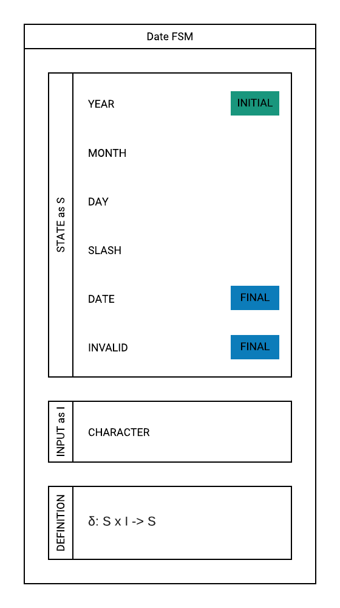
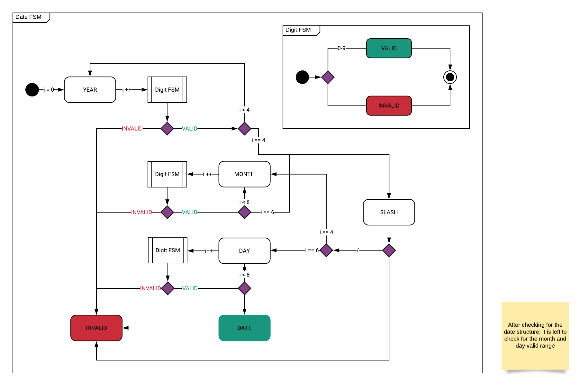
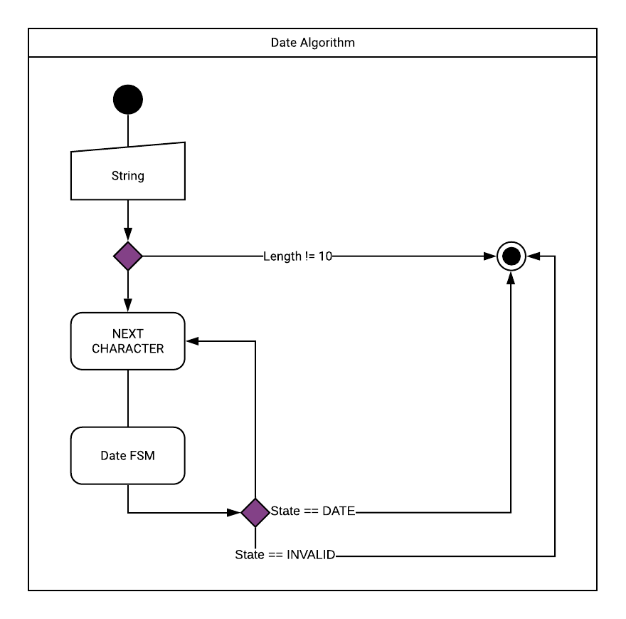
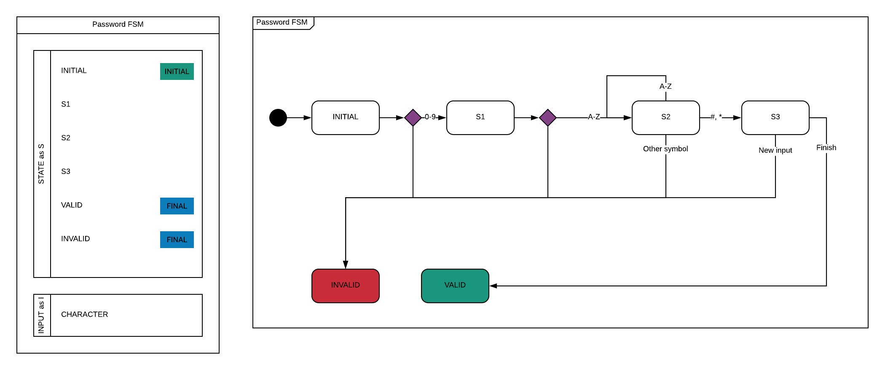
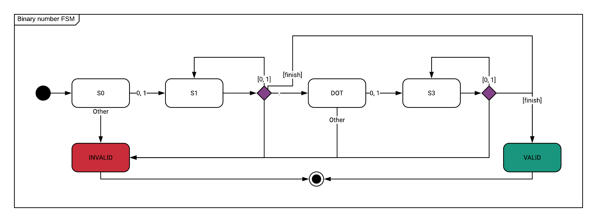
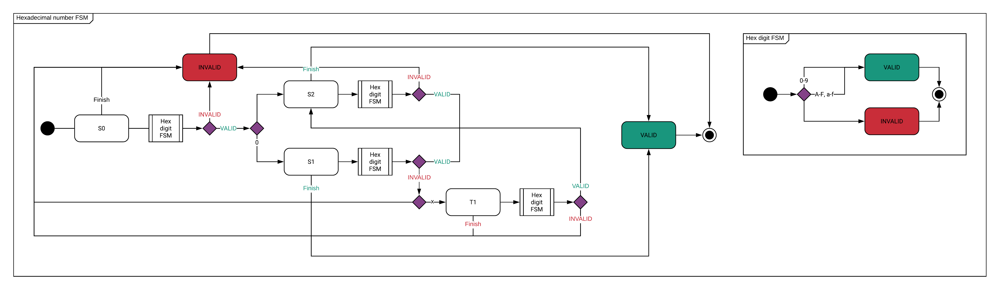

# Example Project: Finite State Machines in CPP

&nbsp;

Example Project for creating finite state machines in OO C++. This initial code
still needs some improvements, I'll be back when I had to work with other C++
projects in order to make use of more C++ skills. More FSMs will be added later.

The Finite State Machines implemented are:

- Date FSM
- Password (or string regex) FSM
- Binary Number FSM
- Hexadecimal Number FSM

## Screenshots

## Algorithms

### Date FSM

### Password FSM

### Binary Number FSM

### Hexadecimal Number FSM

## Contact

This
project: [GitHub Repository](https://github.com/tobiasbriones/ep-fsm-in-cpp)

Tobias Briones: [GitHub](https://github.com/tobiasbriones)

## About

**Example Project: Finite State Machines**

Example Project for creating finite state machines in OO C++.

Copyright © 2019-2021 Tobias Briones. All rights reserved.

### License

This software is licensed under the [MIT License](./LICENSE).
